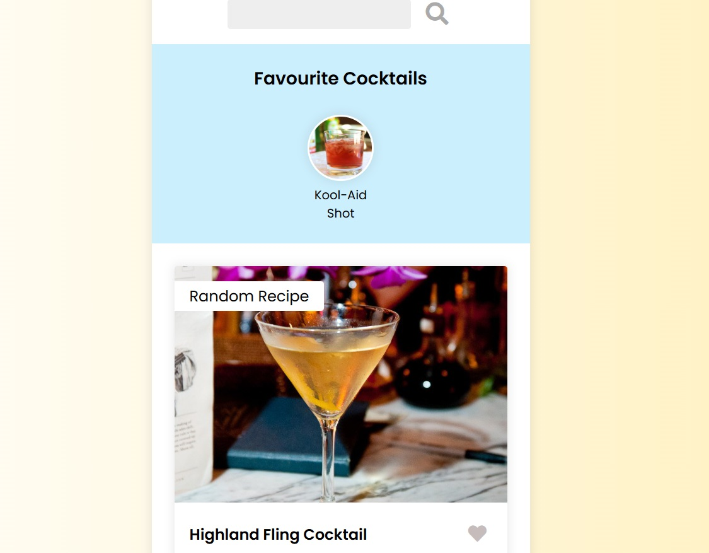

# 🍹 Cocktail App

Aplikacja webowa pozwalająca na wyszukiwanie przepisów na koktajle przy użyciu [TheCocktailDB API](https://www.thecocktaildb.com/api.php). Użytkownik może wprowadzić nazwę drinka, a aplikacja wyświetli szczegółowe informacje, takie jak składniki, instrukcje przygotowania oraz zdjęcie koktajlu.



## 🔧 Technologie

- HTML5
- CSS3
- JavaScript (ES6)
- Fetch API

## 🚀 Jak uruchomić projekt

1. Sklonuj repozytorium:
   ```bash
   git clone https://github.com/piotrkadulawork/cocktail-app.git
2. Przejdź do katalogu projektu:<br>
   cd cocktail-app
3. Otwórz plik index.html w przeglądarce internetowej.<br>
   Możesz również skorzystać z rozszerzenia VS Code "Live Server" lub uruchomić prosty serwer HTTP:<br>
   python3 -m http.server<br>
   Następnie otwórz http://localhost:8000 w przeglądarce.

🧪 Funkcjonalności
- Wyszukiwanie koktajli po nazwie.
- Wyświetlanie szczegółowych informacji o koktajlu:
- Nazwa
- Składniki
- Instrukcje przygotowania
- Obrazek koktajlu